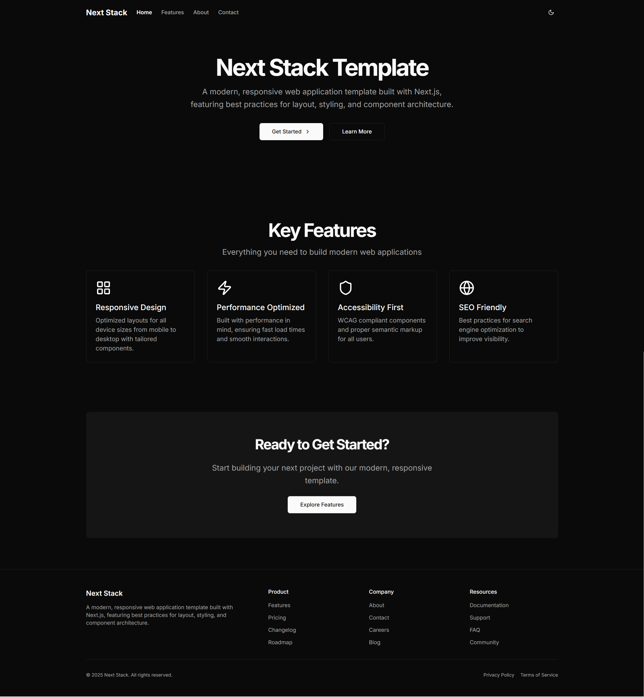

# Next Stack Template

A comprehensive Next.js stack template with Tailwind CSS, Radix UI, and more. Designed to accelerate web application development with best practices built-in.



## 🚀 Features

### 📱 UI/UX

- **Responsive Design** - Optimized layouts for all device sizes with mobile-first approach
- **Modern Aesthetics** - Clean, professional UI with careful attention to typography and spacing
- **Dark Mode Support** - Seamlessly switch between light and dark themes
- **Animations** - Subtle, tasteful animations for enhanced user experience

### 💻 Development

- **TypeScript Support** - Full type safety and improved developer experience
- **Component Architecture** - Modular component design for better code organization and reusability
- **Form Handling** - Integrated form validation with React Hook Form and Zod
- **Development Workflow** - ESLint configuration for code quality

### ⚡ Performance

- **Optimized for Speed** - Built with performance in mind using Next.js best practices
- **SEO Friendly** - Proper metadata configuration for improved search engine visibility
- **Accessibility** - WCAG compliant components with proper semantic markup
- **PWA Support** - Progressive Web App capabilities with offline support and installable experience

### 🗄️ Component Library

- **Shadcn UI** - Built with the Shadcn UI component system for consistency
- **Radix UI** - Accessible, unstyled components as the foundation
- **Custom Components** - Ready-to-use layout components (Container, Header, Footer, etc.)
- **Data Visualization** - Chart components built with Recharts

## 📦 Tech Stack

- **Framework**: [Next.js 15](https://nextjs.org/) with App Router
- **Language**: [TypeScript](https://www.typescriptlang.org/)
- **Styling**: [Tailwind CSS](https://tailwindcss.com/)
- **UI Components**:
  - [Radix UI](https://www.radix-ui.com/)
  - [Shadcn UI](https://ui.shadcn.com/)
- **State Management**: React Hooks
- **Form Handling**:
  - [React Hook Form](https://react-hook-form.com/)
  - [Zod](https://zod.dev/) for validations
- **Icons**: [Lucide React](https://lucide.dev/)
- **Themes**: [next-themes](https://github.com/pacocoursey/next-themes)
- **PWA**: [next-pwa](https://github.com/shadowwalker/next-pwa)
- **Data Visualization**: [Recharts](https://recharts.org/)
- **Date Handling**: [date-fns](https://date-fns.org/)
- **Carousel**: [Embla Carousel](https://www.embla-carousel.com/)
- **Linting**: [ESLint](https://eslint.org/) for code quality and consistency

## 🛠️ Getting Started

### Prerequisites

- Node.js 18.17.0 or later
- npm or yarn or pnpm

### Installation

1. Clone the repository:

   ```bash
   git clone https://github.com/idmiqbal/next-stack-template.git
   cd next-stack-template
   ```

2. Install dependencies:

   ```bash
   npm install
   # or
   yarn install
   # or
   pnpm install
   ```

3. Run the development server:

   ```bash
   npm run dev
   # or
   yarn dev
   # or
   pnpm dev
   ```

4. Open [http://localhost:3000](http://localhost:3000) with your browser to see the result.

5. To build and test the PWA functionality:

   ```bash
   npm run build
   npx serve@latest out
   ```

   Note: PWA features are disabled in development mode and only work in production builds.

## 📂 Project Structure

```
next-stack-template/
├── app/                  # Next.js App Router
│   ├── globals.css       # Global styles
│   ├── layout.tsx        # Root layout
│   ├── page.tsx          # Home page
│   ├── not-found.tsx     # 404 page
│   ├── about/            # About page
│   ├── account/          # Account page
│   ├── contact/          # Contact page
│   ├── docs/             # Documentation page
│   ├── features/         # Features page
│   ├── privacy/          # Privacy policy page
│   └── terms/            # Terms of service page
├── components/           # React components
│   ├── common/           # Common components like ErrorBoundary
│   ├── layout/           # Layout components (Header, Footer, etc.)
│   ├── ui/               # UI components (Button, Card, etc.)
│   └── theme-provider.tsx # Theme provider component
├── hooks/                # Custom React hooks
│   ├── use-media-query.ts # Media query hook
│   └── use-toast.ts      # Toast hook
├── lib/                  # Utility functions and constants
│   ├── constants.ts      # Global constants
│   └── utils.ts          # Utility functions
├── public/               # Static assets
│   ├── favicon.ico       # Favicon for browser tabs
│   ├── icon.png          # PWA icon
│   ├── manifest.json     # PWA manifest file
│   ├── sw.js             # Service worker (generated)
│   └── worker.js         # Worker script (generated)
├── .eslintrc.json        # ESLint configuration
├── .gitignore            # Git ignore file
├── components.json       # Shadcn UI configuration
├── next-env.d.ts         # Next.js TypeScript declarations
├── next.config.js        # Next.js configuration with PWA setup
├── package.json          # Project dependencies
├── postcss.config.js     # PostCSS configuration
├── tailwind.config.ts    # Tailwind CSS configuration
└── tsconfig.json         # TypeScript configuration
```

## 📄 Available Scripts

- `npm run dev` - Run development server
- `npm run build` - Build the application for production
- `npm run start` - Start a production server
- `npm run lint` - Run ESLint

## 🎨 Customization

### Styling

This template uses Tailwind CSS for styling. The main configuration file is `tailwind.config.ts`. The global styles are defined in `app/globals.css`, which includes CSS variables for the color scheme.

### Theme

The theme can be customized in `app/globals.css`. The template supports both light and dark modes using `next-themes`.

### Components

UI components are built using Shadcn UI and Radix UI. You can find all components in the `components/ui/` directory. Layout components are in the `components/layout/` directory.

## 📱 Responsive Design

The template is built with a mobile-first approach and includes:

- Responsive navigation with mobile drawer
- Responsive layout components
- Media query hooks for conditional rendering

## 📲 Progressive Web App (PWA)

This template comes with full Progressive Web App support, allowing users to install the application on their devices:

- **Offline Support** - Service worker caching for offline access
- **Installable** - Add to home screen functionality
- **Optimized Icons** - Favicon and PWA icons properly configured
- **App Manifest** - Complete web app manifest with proper metadata

The PWA configuration uses `next-pwa` and is set up in the `next.config.js` file. Icons and manifest are located in the `public` directory.

## 🔗 Useful Links

- [Next.js Documentation](https://nextjs.org/docs)
- [Tailwind CSS Documentation](https://tailwindcss.com/docs)
- [Radix UI Documentation](https://www.radix-ui.com/)
- [Shadcn UI Documentation](https://ui.shadcn.com/)
- [next-pwa Documentation](https://github.com/shadowwalker/next-pwa)
- [PWA Web Vitals](https://web.dev/vitals/)
- [TypeScript Documentation](https://www.typescriptlang.org/)
- [ESLint Documentation](https://eslint.org/)

## License

This project is licensed under the [MIT License](https://github.com/idmiqbal/next-stack-template/blob/main/LICENSE).
